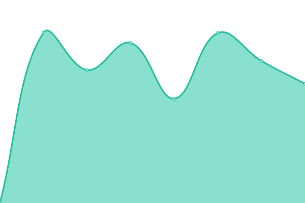

<!--start: status pages-->
<!-- This summary is generated by Upptime (https://github.com/upptime/upptime) -->
<!-- Do not edit this manually, your changes will be overwritten -->
<!-- prettier-ignore -->
| URL | Status | History | Response Time | Uptime |
| --- | ------ | ------- | ------------- | ------ |
|  [IREA](https://irea.kiminet.com) | 🟩 Up | [irea.yml](https://github.com/biz-brows/upptime/commits/HEAD/history/irea.yml) | 

 642ms
     
 | 

<a href="https://biz-brows.github.io/upptime/history/irea">100.00%</a>
    

|  IREA BE | 🟩 Up | [irea-be.yml](https://github.com/biz-brows/upptime/commits/HEAD/history/irea-be.yml) | 

 874ms
     
 | 

<a href="https://biz-brows.github.io/upptime/history/irea-be">100.00%</a>
    

|  IREA ADMIN BE | 🟩 Up | [irea-admin-be.yml](https://github.com/biz-brows/upptime/commits/HEAD/history/irea-admin-be.yml) | 

 954ms
     
 | 

<a href="https://biz-brows.github.io/upptime/history/irea-admin-be">100.00%</a>
    

|  IREA ADMIN FE | 🟩 Up | [irea-admin-fe.yml](https://github.com/biz-brows/upptime/commits/HEAD/history/irea-admin-fe.yml) | 

 789ms
     
 | 

<a href="https://biz-brows.github.io/upptime/history/irea-admin-fe">100.00%</a>
    

<!--end: status pages-->

## 📄 License

- Data in the `./history` directory: [Open Database License](https://opendatacommons.org/licenses/odbl/1-0/)
